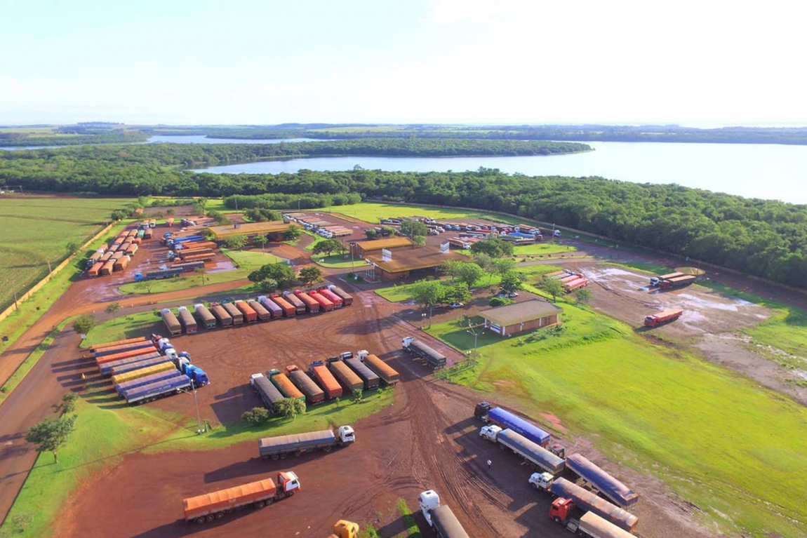

```{r setup}
#| include = FALSE

options(htmltools.dir.version = FALSE)
knitr::opts_chunk$set(
  fig.width=9, fig.height=3.5, fig.retina=3,
  out.width = "100%",
  cache = FALSE,
  echo = TRUE,
  message = FALSE, 
  warning = FALSE,
  hiline = TRUE
)
```

```{r xaringan_themer, include=FALSE, warning=FALSE}
#| echo = FALSE

library(xaringanthemer)
style_duo_accent(primary_color = "#022859", secondary_color = "#03A696")
```

```{r label = 'logo'}
#| echo = FALSE

xaringanExtra::use_logo(
  image_url = "logo_receita_01.png",
  width = "198px",
  height = "216px",
  position = xaringanExtra::css_position(top = "0em", right = "3em"))

```


```{r label = 'bibliotecas'}
#| echo = FALSE

library(tidyverse)
library(readxl)
library(forcats)
library(ggrepel)
library(scales)
library(patchwork)
library(gridExtra)
library(plotly)
library(gganimate)
library(gifski)
source("R/funcao_tema_graficos.R")

```

```{r label = 'carregamento_base'}
#| echo = FALSE

impo <- read_xlsx("importacao/importacao_acumulada.xlsx")

```

## Porto de Santa Helena

<center></center>

.footnote[*Img.01 -Porto Internacional de Santa Helena/PR*]

---

## Localização Geográfica

<center></center>

.footnote[*Img.02 - Localização geográfica do Porto de Santa Helena e do Porto Índio*]

---

### Área de Controle Integrado

- Fundação em 2002
- Tipo de cabeceira única
- Integrada na modalidade cargas e TVF - turismo
- Órgãos brasileiros:

 - Secretaria da Receita Federal do Brasil (SRFB)
 - Departamento da Polícia Federal (DPF)
 - Ministério da Agricultura Pecuária e Abastecimento (MAPA)
 
- Órgãos paraguaios:
 - Dirección Nacional de Aduanas (DNA)
 - Secretaria Nacional de Calidad y Sanidad Vegetal y de Semillas (SENAVE)
 - Migraciones
 - Dirección Nacional de Transporte (DINATRAN)


---
class: inverse center middle

# Importação

---


```{r label = 'paletas de cores'}
#| echo = FALSE

# paleta com quatro cores
paleta_4_cores_impo_vol <- c("#374043", "#F6993C", "#E06100", "#5DAC7F")
paleta_4_cores_expo_val <- c("#03294E", "#204E83", "#7A72C0", "#DDA448")
# paleta com cinco cores
paleta_5_cores_impo_vol <- c("#AE2030", "#8B4095", "#6A5E68", "#F2A519", "#28B46D")
```

### Volumes na importação 

<br>

```{r echo=FALSE, label= 'plot01_volumes_importação'}
#| out.width = "80%",
#| fig.align = "center",
#| echo = FALSE

# gráfico volumes de importação por ano 
# base
peso_vol_impo <- impo |> 
   select(
      "produto",
      "ano",
      "peso"
      ) |> 
   group_by(ano) |> 
   summarise(volumes = sum(peso)) |> 
   mutate(ano = as.factor(ano))
  
# gráfico
plot1 <- peso_vol_impo |> 
  ggplot()+
  aes(x = ano, 
      y = volumes,
      fill = ano,
      label = volumes)+
  geom_col()+
  geom_label(
    vjust = -0.5,
    colour = "#000000",
    alpha = 0
    )+
  theme_enem_fundo_branco()+
  labs(
    title = "Toneladas x ano",
    x = "",
    y = ""
    )+
  scale_y_continuous(
    labels = comma_format(
    big.mark = ".",
    decimal.mark = ","
    ),
    limits = c(0, 800000),
    breaks = seq(0, 800000, 200000))+
  scale_fill_manual(values = paleta_4_cores_impo_vol) +
  theme(
    legend.position = "none",
    plot.title = element_text(
            size = 16,
            face = "bold",
            family = "",
            hjust = 0,
            margin = unit(c(0, 0, 0.5, 0.5), "cm")
        ))
 
plot1
```

.footnote[*Fig.01 - Volumes em toneladas dos produtos importados no período de 2019 a 2022*. _**Fonte**_: *IRF/SHA*]

---

### Valores na importação

<br>

```{r label = 'plot02_valores_exportacao'}
#| out.width = "80%",
#| fig.align = "center",
#| echo = FALSE,

# gráfico valores de importação por ano
# base
peso_val_impo <- impo |> 
   select(
      "produto",
      "ano",
      "valor"
   ) |> 
   group_by(ano) |> 
   summarise(valores = sum(valor)) |> 
   mutate(ano = as.factor(ano))

# gráfico
plot2 <- peso_val_impo |> 
  ggplot()+
  aes(x = ano, 
      y = valores,
      fill = ano,
      label = valores)+
  geom_col()+
  geom_label(
    vjust = -0.5,
    colour = "#000000",
    alpha = 0
    )+
  theme(
    legend.position = "none"
    )+
  theme_enem_fundo_branco()+
  labs(
    title = "Dólares x ano",
    x = "",
    y = ""
    )+
  scale_y_continuous(labels = comma_format(
    big.mark = ".",
    decimal.mark = ","
    ),
    limits = c(0, 250000000),
    breaks = seq(0, 250000000, 50000000))+
  scale_fill_manual(values = paleta_4_cores_expo_val)+
  theme(
    legend.position = "none",
    plot.title = element_text(
            size = 16,
            face = "bold",
            family = "",
            hjust = 0,
            margin = unit(c(0, 0, 0.5, 0.5), "cm")))

plot2

```
.footnote[*Fig.02 - Valores em dólares dos produtos importados no período de 2019 a 2022*. _**Fonte**_: *IRF/SHA*]

---

### Fluxo mensal da importação

<br>

```{r label = 'plot03_fluxo_mercadorias_ao_longo_ano'}
#| echo = FALSE,
#| out.width = '75%',
#| fig.align = "center",

# gráfico dinâmico do fluxo do porto de santa helena
anim_impo_mes <- impo |> 
   select(mes, peso, ano) |> 
   group_by(mes, ano) |> 
   summarise(volume = sum(peso)) |> 
   ggplot()+
   aes(x = mes, y = volume)+
   geom_line(color = "#3185FC",
             size = 0.5,
             lineend = "round")+
   geom_point(color = "red")+
   facet_wrap(~ ano)+
   scale_x_continuous(
      breaks = seq(0, 12, 1)
   )+
   labs(
      x = "Meses de janeiro a dezembro",
      y = "Volume em toneladas",
    )+
   transition_reveal(mes)+
   theme_enem_fundo_branco()+
  theme_linedraw()


animate(
   anim_impo_mes,
   nframes = 40,
   duration = 12,
   start_pause = 2,
   end_pause = 8,
   width = 800,
   height = 400
)


```
.footnote[*Fig.03 - Dinâmica das importações mês a mês no período de 2019 a 2022*. _**Fonte**_: *IRF/SHA*]

---
### Fluxo mensal da importação por produto

```{r label= "plot04_1_importacao_produto1"}
#| out.width = "60%",
#| fig.align = "left",
#| echo = FALSE,

paleta_5_cores_impo_vol <- c("#AE2030", "#8B4095", "#6A5E68", "#F2A519", "#28B46D")
paleta_5_cores_impo_vol2 <- c("#8B4095", "#6A5E68", "#F2A519", "#28B46D", "#AE2030")

vol_impo_mes_produto_2020 <- impo |> 
   filter(ano == "2020") |> 
   select(produto, peso, mes) |> 
   group_by(mes, produto) |> 
   summarise(volume = sum(peso)) |> 
   mutate(produto = as.factor(produto))

plot4_1 <- vol_impo_mes_produto_2020 |> 
   ggplot()+
   aes(
      x = mes,
      y = volume,
      label = volume,
      color = produto,
      group = produto
   )+
   geom_line()+
   geom_point(size = 3)+
   scale_x_continuous(
      breaks = seq(0, 12, 1)
   )+
   theme_enem_fundo_branco()+
   labs(
      title = "Volumes para 2020",
      subtitle = "Valores em toneladas",
      x = "",
      y = ""
   )+
   scale_color_manual(values = paleta_5_cores_impo_vol)+
   theme(
   legend.title = element_text(size = 10),
   legend.text = element_text(size = 8))

plot4_1 
```

```{r label= "plot04_2_importacao_produto2"}
#| out.width = "60%",
#| fig.align = "right",
#| echo = FALSE,

vol_impo_mes_produto_2021 <- impo |> 
   filter(ano == "2021") |> 
   select(produto, peso, mes) |> 
   group_by(mes, produto) |> 
   summarise(volume = sum(peso)) |> 
   mutate(produto = as.factor(produto))

plot4_2 <- vol_impo_mes_produto_2021 |> 
   ggplot()+
   aes(
      x = mes,
      y = volume,
      label = volume,
      color = produto,
      group = produto
   )+
   geom_line()+
   geom_point(size = 3)+
   scale_x_continuous(
      breaks = seq(0, 12, 1)
   )+
   theme_enem_fundo_branco()+
   labs(
      title = "Volumes para 2021",
      subtitle = "Valores em toneladas",
      x = "",
      y = ""
   )+
   scale_color_manual(values = paleta_5_cores_impo_vol2)+
   theme(
   legend.title = element_text(size = 10),
   legend.text = element_text(size = 8))

plot4_2 
```
.footnote[*Fig.04 - Sazonalidade das culturas de milho e soja nos anos 2020 e 2021*. _**Fonte**_: *IRF/SHA*]

---
### Importações por produtos e ano

<br>

```{r label = "plot05 _volumes_produto_ano"}
#| echo = FALSE,
#| fig.width = 9,
#| fig.heigth = 2,
#| fig.align = "center"

# gráfico de volume de mercadorias por ano na importação (anos de 2019, 2020, 2021, 2022)
# base
mercadoria_vol <- impo |>
  select(produto, peso, ano) |>
  group_by(produto, ano) |>
  summarise(volume = sum(peso)) |>
  mutate(
    produto = fct_reorder(
      produto,
      volume,
      .desc = TRUE
    ),
    ano = as.factor(ano)
  )
   
# gráfico
plot5 <- mercadoria_vol |> 
  ggplot()+
  aes(
    x = produto,
    y = volume,
    fill = ano,
    label = volume
    )+
  geom_col(
    position = "dodge",
    color = "#000000",
    size = 0.3,
    alpha = 0.7)+
  geom_label(
    aes(label = round(volume,0)),
    vjust = -0.2,
    alpha = 0.5,
    position = position_dodge(width = 1),
    size = 1.8,
    label.size = 0,
    color = "#000000",
    label.padding = unit(0.1, "lines")
    )+
  theme_enem_fundo_branco()+
  labs(
    title = "Volumes por tipo de produto e ano",
    subtitle = "Valores em toneladas",
    x = "",
    y = ""
    )+
  guides(
    fill = guide_legend(
      title = "Ano",
      override.aes = aes(label = "")
      )
    )+
  scale_y_continuous(labels = comma_format(
    big.mark = ".",
    decimal.mark = ","
    ),
    limits = c(0, 600000))+
  scale_fill_manual(values = paleta_4_cores_expo_val)+
  theme(
    plot.title = element_text(
      size = 13,
      face = "bold",
      family = "",
      hjust = 0,
      margin = unit(c(0, 0, 0.5, 0.5), "cm")
      ),
    axis.text.x = ggplot2::element_text(                                  # texto do eixo x
      color = "#000E14",
      size = 8,
      face = "plain",
      margin = ggplot2::unit(c(0.3, 0, 0.5, 0), "cm")
      ),
    axis.text.y = ggplot2::element_text(                                  # texto do eixo y
      color = "#000E14",
      size = 8,
      face = "plain",
            family = "",
      margin = ggplot2::unit(c(0, 0.5, 0, 0.5), "cm")),
    axis.title = ggplot2::element_text(                         # texto do título eixo x/y
      face = "bold",
      size = 10,
      hjust = 0.5),
    legend.title = element_text(size = 8),
    legend.text = element_text(size = 6))+
   theme(
        plot.subtitle = ggplot2::element_text(                                      # subtítulo
            size = 10,
            family = "",
            hjust = 0,
        ))

plot5
```
.footnote[*Fig.05 - Principais produtos na importação e seus volumes em toneladas no período de 2019 a 2022*. _**Fonte**_: *IRF/SHA*]


---
### Número de DI's por ano

<br><br>

```{r label = "plot06 _número_dis"}
#| out.width = "70%",
#| fig.align = "center",
#| echo = FALSE

# Quantidades de processos de importação por ano
num_di <- read_xlsx("data-raw/numero_dis.xlsx")

num_di <- num_di |> 
   group_by(ano) |> 
   summarise(qte_di_ano = sum(qte_di)) |> 
   mutate(ano = as.factor(ano))

plot6 <- num_di |> 
   ggplot()+
   aes(x = ano, 
       y = qte_di_ano,
       fill = ano,
       label = qte_di_ano)+
   geom_col()+
   geom_label(
      vjust = -0.5,
      colour = "#000000",
      alpha = 0
   )+
   theme(
      legend.position = "none",
      plot.title = element_text(
         size = 15,
         face = "bold",
         family = "",
         hjust = 0,
         margin = unit(c(0, 0, 0.5, 0.5), "cm")
      )
   )+
   theme_enem_fundo_branco()+
   labs(
      title = "Quantidade de DI's x ano",
      x = "",
      y = ""
   )+
   scale_fill_manual(values = paleta_4_cores_impo_vol)+
   scale_y_continuous(
      limits = c(0,600),
      breaks = seq(0, 600, 100))
   
   

plot6
```
.footnote[*Fig.06 - Número de DI's no período de 2019 a 2022*. _**Fonte**_: *IRF/SHA*]


---
class: inverse center middle

# Exportação

---
```{r label = 'leitura_base_exportacao_e_preparacao'}
#| echo = FALSE

expo <- read_csv("data/expo.csv")

# Volumes na exportação
volumes_expo_ton <- expo |> 
   select(ano_desembaraco, peso_liquido_expo_kg) |> 
   group_by(ano_desembaraco) |> 
   summarise(volumes_kg = sum(peso_liquido_expo_kg), volumes_ton = volumes_kg/1000) |> 
   mutate(ano_desembaraco = as.factor(ano_desembaraco))


```

### Volumes na exportação

<br><br>

```{r echo=FALSE, label= 'plot07_volumes_exportacao'}
#| out.width = "70%",
#| fig.align = "center",
#| echo = FALSE

# gráfico
plot7 <- volumes_expo_ton |> 
   ggplot()+
   aes(x = ano_desembaraco, 
       y = volumes_ton,
       fill = ano_desembaraco,
       label = round(volumes_ton,2))+
   geom_col()+
   geom_label(
      vjust = -0.5,
      colour = "#000000",
      alpha = 0
   )+
   theme_enem_fundo_branco()+
   labs(
      title = "Toneladas x ano",
      x = "",
      y = ""
   )+
   scale_y_continuous(
      labels = comma_format(
         big.mark = ".",
         decimal.mark = ","
      ),
      limits = c(0, 60000),
      breaks = seq(0, 60000, 20000))+
   scale_fill_manual(values = paleta_4_cores_impo_vol) +
   theme(
      legend.position = "none",
      plot.title = element_text(
         size = 16,
         face = "bold",
         family = "",
         hjust = 0,
         margin = unit(c(0, 0, 0.5, 0.5), "cm")
      ))

plot7

```
.footnote[*Fig.07 - Volumes em toneladas dos produtos importados no período de 2019 a 2022*. _**Fonte**_: *IRF/SHA*]

---
### Valores na exportação

<br><br>

```{r label = 'plot08_valores_exportacao'}
#| out.width = "70%",
#| fig.align = "center",
#| echo = FALSE

# valores na exportação

valores_expo_ton <- expo |> 
   select(ano_desembaraco, vmle_dolar_expo) |> 
   group_by(ano_desembaraco) |> 
   summarise(valores = sum(vmle_dolar_expo)) |> 
   mutate(ano_desembaraco = as.factor(ano_desembaraco))

# gráfico
plot08 <- valores_expo_ton |> 
   ggplot()+
   aes(x = ano_desembaraco, 
       y = valores,
       fill = ano_desembaraco,
       label = round(valores,2))+
   geom_col()+
   geom_label(
      vjust = -0.5,
      colour = "#000000",
      alpha = 0
   )+
   theme(
      legend.position = "none"
   )+
   theme_enem_fundo_branco()+
   labs(
      title = "Dólares x ano",
      x = "",
      y = ""
   )+
   scale_y_continuous(labels = comma_format(
      big.mark = ".",
      decimal.mark = ","
   ),
   limits = c(0, 25000000),
   breaks = seq(0, 25000000, 5000000))+
   scale_fill_manual(values = paleta_4_cores_expo_val)+
   theme(
      legend.position = "none",
      plot.title = element_text(
         size = 16,
         face = "bold",
         family = "",
         hjust = 0,
         margin = unit(c(0, 0, 0.5, 0.5), "cm")))

plot08


```
.footnote[*Fig.08 - Valores em dólares dos produtos exporados no período de 2019 a 2022*. _**Fonte**_: *IRF/SHA*]


---
### Fluxo mensal da exportação

<br>

```{r label = 'plot09_fluxo_mercadorias_ao_longo_ano'}
#| echo = FALSE,
#| out.width = '80%',
#| fig.align = "center",

# gráfico dinâmico do fluxo de exportação do porto de santa helena
volumes_expo_ton_mes <- expo |> 
   select(ano_desembaraco, peso_liquido_expo_kg, mes_desembaraco) |> 
   group_by(ano_desembaraco, mes_desembaraco) |> 
   summarise(volumes_kg = sum(peso_liquido_expo_kg), volumes_ton = volumes_kg/1000) |> 
   mutate(ano_desembaraco = as.factor(ano_desembaraco), mes_desembaraco = as.numeric(mes_desembaraco))

anim_expo_mes <- volumes_expo_ton_mes |> 
   select(mes_desembaraco, volumes_ton, ano_desembaraco) |> 
   group_by(mes_desembaraco, ano_desembaraco) |> 
   summarise(volume = sum(volumes_ton)) |> 
   ggplot()+
   aes(x = mes_desembaraco, y = volume)+
   geom_line(color = "#3185FC",
             size = 0.5,
             lineend = "round")+
   geom_point(color = "red")+
   facet_wrap(~ ano_desembaraco)+
   scale_x_continuous(
      breaks = seq(0, 12, 1)
   )+
   labs(
      x = "Meses de janeiro a dezembro",
      y = "Volume em toneladas",
   )+
   transition_reveal(mes_desembaraco)+
   theme_enem_fundo_branco()+
   theme_linedraw()

anim_expo_mes

```
.footnote[*Fig.09 - Dinâmica das exportações mês a mês no período de 2019 a 2022*. _**Fonte**_: *IRF/SHA*]


---
### Número de DUE's por ano

<br><br>

```{r label = "plot10 _número_dues"}
#| out.width = "70%",
#| fig.align = "center",
#| echo = FALSE

# Quantidade de dues por ano

num_due <- expo |> 
   group_by(ano_desembaraco) |> 
   summarise(qte_due_ano = n()) |> 
   mutate(ano_desembaraco = as.factor(ano_desembaraco))

plot10 <- num_due |> 
   ggplot()+
   aes(x = ano_desembaraco, 
       y = qte_due_ano,
       fill = ano_desembaraco,
       label = qte_due_ano)+
   geom_col()+
   geom_label(
      vjust = -0.5,
      colour = "#000000",
      alpha = 0
   )+
   theme(
      legend.position = "none",
      plot.title = element_text(
         size = 15,
         face = "bold",
         family = "",
         hjust = 0,
         margin = unit(c(0, 0, 0.5, 0.5), "cm")
      )
   )+
   theme_enem_fundo_branco()+
   labs(
      title = "Quantidade de DUE's x ano",
      x = "",
      y = ""
   )+
   scale_fill_manual(values = paleta_4_cores_impo_vol)+
   scale_y_continuous(
      limits = c(0, 1000),
      breaks = seq(0, 1000, 200)
   )


plot10
```
.footnote[*Fig.10 - Número de DUE's no período de 2019 a 2022*. _**Fonte**_: *IRF/SHA*]


---
class: inverse center middle

# Controle de bagagem

---

---


---
class: center, middle

# Obrigado!

Esta apresentação está disponível em:

[**xaringan**]